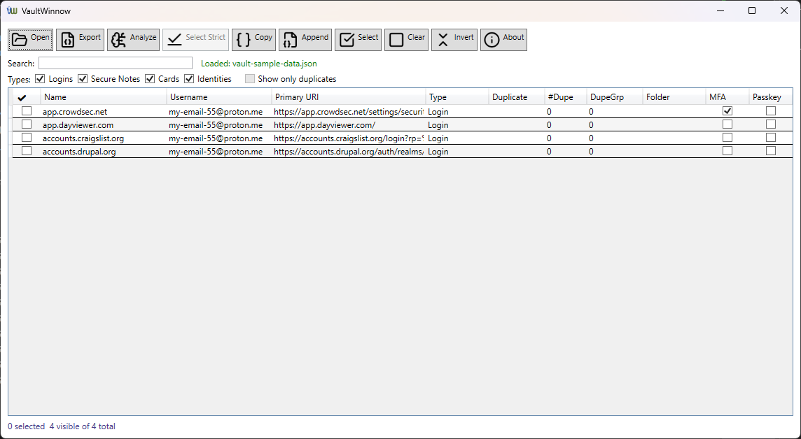

# VaultWinnow

VaultWinnow is a small Windows desktop tool for **winnowing** Bitwarden / Vaultwarden
vault exports: load a JSON export, pick the items you want, and produce a clean,
import-ready JSON file (or clipboard text) containing only those items.

Built with WPF and .NET, intended to be simple, offline, and free/open source.

Download the latest release at https://github.com/cliftonfoster/vault-winnow/releases.

---

## Why?

Bitwarden and Vaultwarden let you export your whole vault, but not “just these
few items”. VaultWinnow fills that gap:

- Filter large vaults down to a focused subset.
- Move a handful of entries into a new vault or instance.
- Build custom vaults for testing, migration, or sharing.

---

## Features

Load an unencrypted Bitwarden / Vaultwarden JSON export.

View all items in a grid:

- Select checkbox
- Type (Login, Secure Note, Card, Identity)
- Name
- Username
- Primary URI
- Folder name
- Indicators for TOTP (MFA) and passkeys (FIDO2 credentials)

Search and filter:

- Search as you type by name, username, URI, or folder name.
- Type filters to quickly show only Logins, Secure Notes, Cards, or Identities.
- Footer counts reflect both search and type filters.

Selection helpers (respecting filters):

- Select All (selects only the currently visible, filtered items).
- Clear Selection (clears selection only for the visible, filtered items).
- Invert Selection to flip checkboxes for all visible items.

Options panel and column visibility  
- Collapsible Options panel (collapsed by default) groups type filters (Logins, Secure Notes, Cards, Identities), the “Show only duplicates” toggle, and column visibility checkboxes (Dup, Count, Group, MFA, Passkey).

Duplicate analysis for logins  
- Labels each login as Strict, Almost, or None without changing Bitwarden’s JSON format.  
- Strict: same site, name, username, password, notes, TOTP, and passkeys – safe to auto-select duplicates (one kept, the rest can be removed).  
- Almost: same site but important details differ (name, password, notes, 2FA/TOTP, or passkeys) – always review manually.  
- None: everything else, including reused passwords on different sites and non-login items.  
- A “Dup”, “Count”, and “Group” column show status, group size, and a stable group id so related Strict/Almost entries stay adjacent when sorted.  
- A “Show only duplicates” toggle filters the view to Strict/Almost items, combined with existing search and type filters.

Toolbar icons and shortcuts  
- Compact toolbar with grouped icon+text buttons and descriptive tooltips for Open, Close, Export, Copy, Append, Select, Clear, Invert, Analyze duplicate analysis, Dup Help, Select Strict, and About. (Shortcuts: Ctrl+O, Ctrl+W, Ctrl+E, Ctrl+C, Ctrl+A, Ctrl+L.)

Export options and safety:

- Export selected items to a new JSON file.
- Copy the export JSON directly to the clipboard (for Bitwarden’s paste box).
- Append the current selection to an existing filtered JSON and save as a new file.
- Folder trimming so the exported JSON includes only folders actually used by the selected items.
- Status bar shows loaded file information with a tooltip revealing the full path on hover.
- All output is designed to remain import-compatible with Bitwarden / Vaultwarden’s JSON import.

---

## Screenshots



---

## Getting Started

### Requirements

- Windows 10 or later
- .NET 10 Desktop Runtime

### Running from source

1. Clone the repo:

   ```bash
   git clone https://github.com/cliftonfoster/vault-winnow.git
   cd vault-winnow
   ```

1. Open `VaultWinnow.sln` in Visual Studio 2022 (or later).
2. Restore NuGet packages (Visual Studio will usually do this on build).
3. Set the configuration to `Release` or `Debug` as desired and press **F5** to run.

------

## Usage

1. **Export from Bitwarden / Vaultwarden**

   - In your vault, export as **unencrypted JSON** (not encrypted JSON, CSV, etc.).
   - Save the file to a safe location.

2. **Load the export**

   - Start VaultWinnow.
   - Click **Open** (or press **Ctrl+O**) and choose the exported vault file.
   - The grid will populate with all items and folder names.

3. **Filter and select**

   - Use the **Search** box to narrow by name, username, URI, or folder.
   - Use the **Types** checkboxes to focus on Logins, Secure Notes, Cards, or Identities.
   - Tick the checkboxes for the items you want to keep.
   - Use **Select** / **Clear** (or **Ctrl+A** / **Ctrl+L**) to adjust quickly; these operate
      on the currently visible, filtered items.
   - The footer shows how many items are loaded, visible, and selected.

4. **Export selected items**

   You have three options:

   - **Export**
      Saves a new JSON file with only the selected items and their used folders.
   - **Copy**
      Builds the same JSON and copies it to the clipboard, ready to paste into
      Bitwarden’s “Import from JSON (copy & paste)” box.
   - **Append**
     - Select the items you want to add.
     - Click **Append**.
     - Choose an existing filtered JSON file (for example, a previous 25-item export).
     - Confirm the append when prompted.
     - Choose a new filename. The resulting file contains:
       - All original items from the chosen file.
       - Plus the items you just selected.
       - With folders merged and deduplicated by ID.

------

## Project Structure

```
VaultWinnow/
├── Models/
│   └── VaultModels.cs       # JSON models (VaultExport, VaultItem, login/card/identity/etc.)
├── MainWindow.xaml          # Main UI (toolbar, search box, Options panel, DataGrid) 
├── MainWindow.xaml.cs       # Load, filter, selection, duplicate analysis wiring, column visibility, export/copy/append logic
├── AboutWindow.xaml         # About dialog UI
├── AboutWindow.xaml.cs      # About dialog logic (GitHub/Ko‑fi links) 
├── DuplicateHelpWindow.xaml     # Duplicate analysis help dialog UI
├── DuplicateHelpWindow.xaml.cs  # Help dialog logic
└── VaultWinnow.csproj       # WPF project file
```

The JSON model layer is intentionally close to the Bitwarden/Vaultwarden export
 structure so that imports/exports remain compatible.

------

## Security and Privacy

- VaultWinnow operates entirely **locally**:
  - Reads JSON exports from disk.
  - Writes JSON exports to disk or copies them to the clipboard.
  - No network calls are made.
- Your vault data stays on your machine; still, exported JSON is sensitive and
   should be deleted when no longer needed.
-  Only **unencrypted** export files are supported. Encrypted exports must be
   decrypted via Bitwarden/Vaultwarden before use.
   
------

## Antivirus & Integrity

- SHA-256 (VaultWinnow-0.4.0-beta.exe):  
  `599529117c5207041db5680be8cf77153c1190e561e3ec7c71df4c4f09de6bed`

- VirusTotal:  
  🛡️ [Scan results for VaultWinnow-0.4.0-beta.exe](https://www.virustotal.com/gui/file/599529117c5207041db5680be8cf77153c1190e561e3ec7c71df4c4f09de6bed)

------

## Roadmap / Ideas

Planned or potential future enhancements:

- Additional export formats (KeePass, 1Password, etc.).
- Per-item preview/details pane.
- Dark mode and other visual themes.
- Column sorting and optional saved column layouts.

Suggestions and PRs for small, focused features that keep the app simple are welcome.

------

## Contributing

Issues and pull requests are encouraged:

1. Fork the repository.
2. Create a feature branch.
3. Make your changes in small, focused commits.
4. Open a pull request with a clear description of the change and rationale.

------

## License

This project is licensed under the **MIT License**. See the `LICENSE` file for details.

------

## Support

VaultWinnow is a small side project that I maintain in my free time.
 If it’s useful to you and you’d like to say thanks, you can support me here:

[☕ Support me on Ko‑fi](https://ko-fi.com/cliftonfoster)

