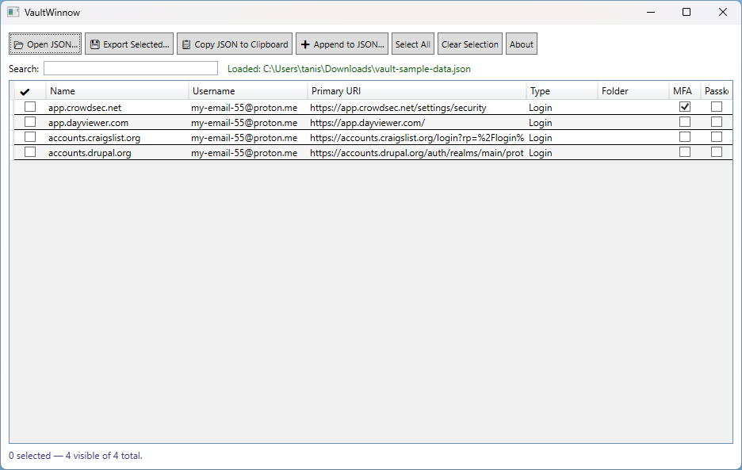

# VaultWinnow

VaultWinnow is a small Windows desktop tool for **winnowing** Bitwarden / Vaultwarden
vault exports: load a JSON export, pick the items you want, and produce a clean,
import-ready JSON file (or clipboard text) containing only those items.

Built with WPF and .NET, intended to be simple, offline, and free/open source.

---

## Why?

Bitwarden and Vaultwarden let you export your whole vault, but not “just these
few items”. VaultWinnow fills that gap:

- Filter large vaults down to a focused subset.
- Move a handful of entries into a new vault or instance.
- Build custom vaults for testing, migration, or sharing.

---

## Features

- **Load** an unencrypted Bitwarden / Vaultwarden JSON export.
- **View** all items in a grid:
  - Select checkbox
  - Type (Login, Secure Note, Card, Identity)
  - Name
  - Username
  - Primary URI
  - Folder name
  - Indicators for TOTP (MFA) and passkeys (FIDO2 credentials)
- **Search** as you type by name, username, URI, or folder name.
- **Selection helpers**:
  - Select All
  - Clear Selection
- **Export options**:
  - Export selected items to a new JSON file.
  - Copy the export JSON directly to the clipboard (for Bitwarden’s paste box).
  - Append the current selection to an existing filtered JSON and save as a new file.
- **Folder trimming**:
  - The exported JSON includes only folders that are actually used by the selected items.

All output is designed to remain import-compatible with Bitwarden / Vaultwarden’s
JSON import.

---

## Screenshots



---

## Getting Started

### Requirements

- Windows 10 or later
- .NET Desktop Runtime (version matching the project’s target framework)

### Running from source

1. Clone the repo:

   ```bash
   git clone https://github.com/cliftonfoster/vault-winnow.git
   cd vault-winnow
   ```

2. Open `VaultWinnow.sln` in Visual Studio 2022 (or later).

3. Restore NuGet packages (Visual Studio will usually do this on build).

4. Set the configuration to `Release` or `Debug` as desired and press **F5** to run.

---

## Usage

1. **Export from Bitwarden / Vaultwarden**

   - In your vault, export as **unencrypted JSON** (not encrypted JSON, CSV, etc.).
   - Save the file to a safe location.

2. **Load the export**

   - Start VaultWinnow.
   - Click **Open JSON…** and choose the exported vault file.
   - The grid will populate with all items and folder names.

3. **Filter and select**

   - Use the **Search** box to narrow by name, username, URI, or folder.
   - Tick the checkboxes for the items you want to keep.
   - Use **Select All** / **Clear Selection** to adjust quickly.
   - The footer shows how many items are loaded, visible, and selected.

4. **Export selected items**

   You have three options:

   - **Export Selected…**  
     Saves a new JSON file with only the selected items and their used folders.

   - **Copy JSON to Clipboard**  
     Builds the same JSON and copies it to the clipboard, ready to paste into
     Bitwarden’s “Import from JSON (copy & paste)” box.

   - **Append to JSON…**  
     - Select the items you want to add.
     - Click **Append to JSON…**.
     - Choose an existing filtered JSON file (for example, a previous 25-item export).
     - Confirm the append when prompted.
     - Choose a new filename. The resulting file contains:
       - All original items from the chosen file.
       - Plus the items you just selected.
       - With folders merged and deduplicated by ID.

---

## Project Structure

```text
VaultWinnow/
├── Models/
│   └── VaultModels.cs       # JSON models (VaultExport, VaultItem, login/card/identity/etc.)
├── MainWindow.xaml          # Main UI: toolbar, search box, DataGrid
├── MainWindow.xaml.cs       # Load, filter, select, export, copy, append logic
├── AboutWindow.xaml         # About dialog UI
├── AboutWindow.xaml.cs      # About dialog logic (GitHub link, close handling)
└── VaultWinnow.csproj       # WPF project file
```

The JSON model layer is intentionally close to the Bitwarden/Vaultwarden export
structure so that imports/exports remain compatible.

---

## Security and Privacy

- VaultWinnow operates entirely **locally**:
  - Reads JSON exports from disk.
  - Writes JSON exports to disk or copies them to the clipboard.
  - No network calls are made.
- Your vault data stays on your machine; still, exported JSON is sensitive and
  should be deleted when no longer needed.
- Only **unencrypted** export files are supported. Encrypted exports must be
  decrypted via Bitwarden/Vaultwarden before use.

---

## Roadmap / Ideas

Planned or potential future enhancements:

- Optional keyboard shortcuts (Ctrl+O, Ctrl+E, etc.).
- More flexible type-aware filtering (e.g., show only Logins or only Notes).
- Column sorting and column visibility toggles.
- Additional export formats (KeePass, 1Password, etc.).
- Per-item preview/details pane.

Suggestions and PRs for small, focused features that keep the app simple are welcome.

---

## Contributing

Issues and pull requests are encouraged:

1. Fork the repository.
2. Create a feature branch.
3. Make your changes in small, focused commits.
4. Open a pull request with a clear description of the change and rationale.

---

## License

This project is licensed under the **MIT License**. See the `LICENSE` file for details.

---

## Support

VaultWinnow is a small side project that I maintain in my free time. 
If it’s useful to you and you’d like to say thanks, you can support me here:

[☕ Support me on Ko‑fi](https://ko-fi.com/cliftonfoster)
